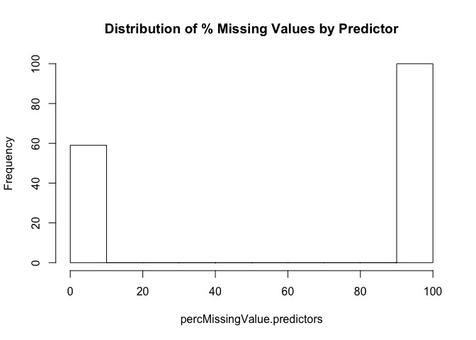
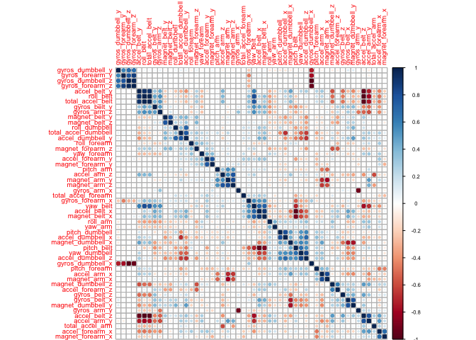
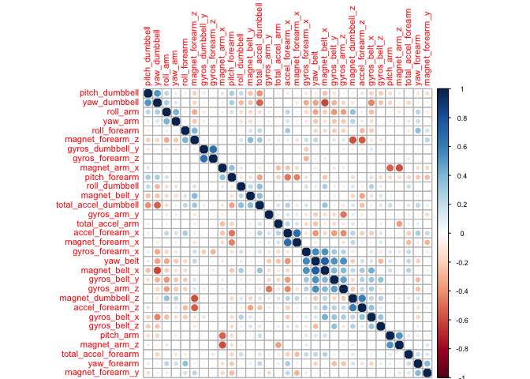
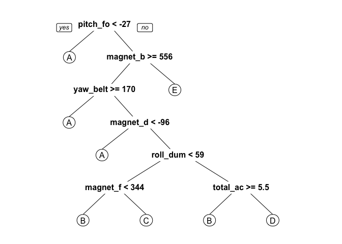

# Practical Machine Learning Assignment
Pier Lorenzo Paracchini  
27 February 2016  


## Overview

_"Using devices such as Jawbone Up, Nike FuelBand, and Fitbit it is now possible to collect a large amount of data about personal activity relatively inexpensively. These type of devices are part of the quantified self movement <U+2013> a group of enthusiasts who take measurements about themselves regularly to improve their health, to find patterns in their behavior, or because they are tech geeks. One thing that people regularly do is quantify how much of a particular activity they do, but they rarely quantify how well they do it. In this project, your goal will be to use data from accelerometers on the belt, forearm, arm, and dumbell of 6 participants. They were asked to perform barbell lifts correctly and incorrectly in 5 different ways. More information is available from the website here: http://groupware.les.inf.puc-rio.br/har (see the section on the Weight Lifting Exercise Dataset)."_

One thing that people regularly do is quantify how much of a particular activity they do, but they rarely quantify how well they do it. The goal of this assignment is to use data from accelerometers on the belt, forearm, arm, and dumbell of 6 participants to predict the manner in which they did the exercise. The __outcome__ of the model is the __class__ variable.

_"Class A corresponds to the specified execution of the exercise, while the other 4 classes correspond to common mistakes. Participants were supervised by an experienced weight lifter to make sure the execution complied to the manner they were supposed to simulate. The exercises were performed by six male participants aged between 20-28 years, with little weight lifting experience. We made sure that all participants could easily simulate the mistakes in a safe and controlled manner by using a relatively light dumbbell (1.25kg)." [1]_

## Data

The training and testing datasets for the assignments are available at the following links:

* training, https://d396qusza40orc.cloudfront.net/predmachlearn/pml-training.csv 
* testing,  https://d396qusza40orc.cloudfront.net/predmachlearn/pml-testing.csv

More information about the dataset can be found at the following link (http://groupware.les.inf.puc-rio.br/har) [1].

### Loading the training dataset

Looking at the content of the file it is possible to see that there missing values "" and "NA". The initial approach is to consider "", "NA" as __NAs__.


```r
data.training <- read.csv("pml-training.csv", stringsAsFactors = FALSE, na.strings=c("", "NA", "NULL"))
```

__Note!__ When loading the data a __simplification__ has been done, "", "NA" and "NULL" have been cosidered as __NA__ (not vailable data).

#### Creating a train and test dataset
From the training dataset `data.training` creates 2 separate datasets, train and test, that wil be used to fit and evaluate the model respectively.


```r
set.seed(19711004)
inTraining <- createDataPartition(data.training$classe, times = 1, p = 0.7, list = FALSE)
trainD <- data.training[inTraining,]
testD <- data.training[-inTraining,]
```

## Exploratory Analysis & Data Transformation

Using the __train__ dataset it is possible to start to explore the available predictors in order to understand the pre-processing steps that need to be performed on the datasets in order to have an "optimal" dataset to fit the model. 

Exploration is done using only the train dataset, the transformations applied to the train dataset will be applied to the test dataset as well.

Number of observations and variables

```r
dim(trainD)
```

```
## [1] 13737   160
```

Summary for some of the variables of the datataset   

```r
#First 15 variables
summary(trainD[,1:15])
```

```
##        X          user_name         raw_timestamp_part_1
##  Min.   :    1   Length:13737       Min.   :1.32e+09    
##  1st Qu.: 4893   Class :character   1st Qu.:1.32e+09    
##  Median : 9803   Mode  :character   Median :1.32e+09    
##  Mean   : 9822                      Mean   :1.32e+09    
##  3rd Qu.:14706                      3rd Qu.:1.32e+09    
##  Max.   :19622                      Max.   :1.32e+09    
##  raw_timestamp_part_2 cvtd_timestamp      new_window          num_window 
##  Min.   :   312       Length:13737       Length:13737       Min.   :  1  
##  1st Qu.:254682       Class :character   Class :character   1st Qu.:222  
##  Median :494715       Mode  :character   Mode  :character   Median :427  
##  Mean   :500165                                             Mean   :433  
##  3rd Qu.:748332                                             3rd Qu.:648  
##  Max.   :998750                                             Max.   :864  
##    roll_belt       pitch_belt        yaw_belt      total_accel_belt
##  Min.   :-28.9   Min.   :-54.90   Min.   :-180.0   Min.   : 0.0    
##  1st Qu.:  1.1   1st Qu.:  1.80   1st Qu.: -88.3   1st Qu.: 3.0    
##  Median :114.0   Median :  5.30   Median : -12.1   Median :17.0    
##  Mean   : 64.7   Mean   :  0.33   Mean   : -10.9   Mean   :11.3    
##  3rd Qu.:123.0   3rd Qu.: 15.20   3rd Qu.:  13.1   3rd Qu.:18.0    
##  Max.   :162.0   Max.   : 60.30   Max.   : 179.0   Max.   :29.0    
##  kurtosis_roll_belt kurtosis_picth_belt kurtosis_yaw_belt 
##  Length:13737       Length:13737        Length:13737      
##  Class :character   Class :character    Class :character  
##  Mode  :character   Mode  :character    Mode  :character  
##                                                           
##                                                           
##                                                           
##  skewness_roll_belt
##  Length:13737      
##  Class :character  
##  Mode  :character  
##                    
##                    
## 
```

Looking at the summary it is possible to see that 

* some variables that have lot of missing values,

* some variables seems to be not relevant for the prediction __e.g. X, user_name, raw_timestamp_part_1, raw_timestamp_part_2, cvtd_timestamp, new_window, num_window, ..__

For comodity lets split the training dataset into a predictors and outcome datasets


```r
trainD.predictors <- trainD[, -160]
trainD.outcome <- as.factor(trainD[, 160])

#Same transformation applied to test
testD.predictors <- testD[, -160]
testD.outcome <- as.factor(testD[, 160])
```

### Dealing with Missing Values
Lets find out the percentage of missing values for each variable using the following simplification, missing value == NA ...


```r
percentageOfMissingValues <- function(x){
    (sum(is.na(x))/length(x))* 100
}

#Percentage of Missing Values into predictors
percMissingValue.predictors <- apply(trainD.predictors, 2, percentageOfMissingValues)
##Higher Percentages
head(percMissingValue.predictors[order(percMissingValue.predictors, decreasing = TRUE)])
##   kurtosis_roll_belt  kurtosis_picth_belt    kurtosis_yaw_belt 
##                 97.9                 97.9                 97.9 
##   skewness_roll_belt skewness_roll_belt.1    skewness_yaw_belt 
##                 97.9                 97.9                 97.9
##Lower Percentages
tail(percMissingValue.predictors[order(percMissingValue.predictors, decreasing = TRUE)])
##  accel_forearm_x  accel_forearm_y  accel_forearm_z magnet_forearm_x 
##                0                0                0                0 
## magnet_forearm_y magnet_forearm_z 
##                0                0

#Percentage of Missing Values into outcome
percentageOfMissingValues(trainD.outcome)
## [1] 0
```


```r
hist(percMissingValue.predictors, main = "Distribution of % Missing Values by Predictor")
```

 

It is possible to see that the variables ends up in two possible bins:

* variables with mainly missing values (__percentage of missing values >90%__)
* variables without missing values (__percentage of missing values 0%__)

For the assignment lets start to consider only the variables that do not have missing values - lets keep those variables


```r
idx_variablesToKeeps <- which(percMissingValue.predictors == 0)
trainD.predictors <- trainD.predictors[, idx_variablesToKeeps]

#Same transformation applied to Test
testD.predictors <- testD.predictors[, idx_variablesToKeeps]
```

The simplified `trainD.predictors` dataset contains only 59 predictors.

### Removing not relevant predictors

Some of the predictors seem to be not relevant (at first sight) for the prediction. Specifically the following predictors __X, user_name, raw_timestamp_part_1, raw_timestamp_part_2, cvtd_timestamp, new_window, num_window__ seem to contain data that is not going to be relevant for the prediction.  


```r
idx_variablesToRemove <- 1:7
trainD.predictors <- trainD.predictors[, -idx_variablesToRemove]

#Same transformation applied to Test
testD.predictors <- testD.predictors[, -idx_variablesToRemove]
```

The simplified `trainD.predictors` dataset contains only 52 predictors.

### Transformation on Individual Predictors

The initial idea is to predict using trees for the prediction. Trees are in general more resilent to skewness and scaling/ centering issues than other models. For this reason those issues will not be considered for the time being.

Focus will be given to remove near-zero-variance predictors and higly correlated predictors.

#### Near-Zero Variance Predictors

For the selected predictors there are not prolematic predictors with Near-Zero Variance.


```r
nsv <- nearZeroVar(trainD.predictors, saveMetrics = TRUE)
nsv
##                      freqRatio percentUnique zeroVar   nzv
## roll_belt                1.147        7.9057   FALSE FALSE
## pitch_belt               1.108       12.2079   FALSE FALSE
## yaw_belt                 1.042       13.0887   FALSE FALSE
## total_accel_belt         1.051        0.2111   FALSE FALSE
## gyros_belt_x             1.008        0.9172   FALSE FALSE
## gyros_belt_y             1.135        0.4950   FALSE FALSE
## gyros_belt_z             1.100        1.2084   FALSE FALSE
## accel_belt_x             1.066        1.1720   FALSE FALSE
## accel_belt_y             1.127        0.9900   FALSE FALSE
## accel_belt_z             1.063        2.0965   FALSE FALSE
## magnet_belt_x            1.149        2.2130   FALSE FALSE
## magnet_belt_y            1.103        2.0747   FALSE FALSE
## magnet_belt_z            1.097        3.1084   FALSE FALSE
## roll_arm                53.932       17.4929   FALSE FALSE
## pitch_arm               79.100       20.1718   FALSE FALSE
## yaw_arm                 30.038       19.0653   FALSE FALSE
## total_accel_arm          1.031        0.4805   FALSE FALSE
## gyros_arm_x              1.000        4.5862   FALSE FALSE
## gyros_arm_y              1.483        2.7007   FALSE FALSE
## gyros_arm_z              1.129        1.7544   FALSE FALSE
## accel_arm_x              1.051        5.5398   FALSE FALSE
## accel_arm_y              1.159        3.8364   FALSE FALSE
## accel_arm_z              1.065        5.5689   FALSE FALSE
## magnet_arm_x             1.000        9.5872   FALSE FALSE
## magnet_arm_y             1.091        6.2386   FALSE FALSE
## magnet_arm_z             1.013        9.0631   FALSE FALSE
## roll_dumbbell            1.092       86.8894   FALSE FALSE
## pitch_dumbbell           2.483       84.8075   FALSE FALSE
## yaw_dumbbell             1.061       86.3362   FALSE FALSE
## total_accel_dumbbell     1.071        0.2985   FALSE FALSE
## gyros_dumbbell_x         1.039        1.7253   FALSE FALSE
## gyros_dumbbell_y         1.242        1.9582   FALSE FALSE
## gyros_dumbbell_z         1.052        1.4268   FALSE FALSE
## accel_dumbbell_x         1.097        2.9628   FALSE FALSE
## accel_dumbbell_y         1.165        3.3195   FALSE FALSE
## accel_dumbbell_z         1.173        2.8827   FALSE FALSE
## magnet_dumbbell_x        1.050        7.8256   FALSE FALSE
## magnet_dumbbell_y        1.139        6.0275   FALSE FALSE
## magnet_dumbbell_z        1.030        4.7973   FALSE FALSE
## roll_forearm            11.410       13.6857   FALSE FALSE
## pitch_forearm           63.395       19.1599   FALSE FALSE
## yaw_forearm             14.730       12.8412   FALSE FALSE
## total_accel_forearm      1.119        0.5096   FALSE FALSE
## gyros_forearm_x          1.135        2.0965   FALSE FALSE
## gyros_forearm_y          1.095        5.2268   FALSE FALSE
## gyros_forearm_z          1.101        2.1111   FALSE FALSE
## accel_forearm_x          1.148        5.6781   FALSE FALSE
## accel_forearm_y          1.100        7.1413   FALSE FALSE
## accel_forearm_z          1.154        4.0475   FALSE FALSE
## magnet_forearm_x         1.036       10.6428   FALSE FALSE
## magnet_forearm_y         1.288       13.2489   FALSE FALSE
## magnet_forearm_z         1.171       11.7857   FALSE FALSE
```

#### Between-Predictor Correlation

Lets calculate the correlation between predictors


```r
trainD.predictors.corr <- cor(trainD.predictors)
```

and let visually examine the corretion structure between the predictors


```r
par(cex = 0.6)
corrplot(trainD.predictors.corr, order = "hclust")
```

 

from the plot is possible to see that there are cluster of highly correlated predictors (see dark blue and dark red points). Another possible simplification is toremove the highly correlated predictors


```r
idx_variableToRemove.highCorr <- findCorrelation(trainD.predictors.corr, cutoff = 0.75)

#Variables with high correlation 
names(trainD.predictors[idx_variableToRemove.highCorr])
##  [1] "accel_belt_z"      "roll_belt"         "accel_belt_y"     
##  [4] "accel_arm_y"       "total_accel_belt"  "accel_dumbbell_z" 
##  [7] "accel_belt_x"      "pitch_belt"        "magnet_dumbbell_x"
## [10] "accel_dumbbell_y"  "magnet_dumbbell_y" "accel_arm_x"      
## [13] "accel_dumbbell_x"  "accel_arm_z"       "magnet_arm_y"     
## [16] "magnet_belt_z"     "accel_forearm_y"   "gyros_forearm_y"  
## [19] "gyros_dumbbell_x"  "gyros_dumbbell_z"  "gyros_arm_x"
trainD.predictors <- trainD.predictors[, -idx_variableToRemove.highCorr]

#Same Transformation applied to Test
testD.predictors <- testD.predictors[, -idx_variableToRemove.highCorr]
```


```r
trainD.predictors.corr <- cor(trainD.predictors)
par(cex = 0.7)
corrplot(trainD.predictors.corr, order = "hclust")
```

 

The simplified `trainD.predictors` dataset contains only 31 predictors.

## Models

The idea is to use trees to predict the outcome. Selection of the trees is mainly connected with the easiness to interpret the model itself.


```r
trainD <- data.frame(outcome = trainD.outcome, trainD.predictors)
testD <- data.frame(outcome = testD.outcome, testD.predictors)
```

### Classification Trees using `rpart`

Fitting the model based on the `train` dataset ...


```r
mod1Fit <- train(outcome ~ ., method = "rpart", data = trainD)
```


```r
print(mod1Fit$finalModel)
```

```
## n= 13737 
## 
## node), split, n, loss, yval, (yprob)
##       * denotes terminal node
## 
##   1) root 13737 9831 A (0.28 0.19 0.17 0.16 0.18)  
##     2) pitch_forearm< -26.65 1233   56 A (0.95 0.045 0 0 0) *
##     3) pitch_forearm>=-26.65 12504 9775 A (0.22 0.21 0.19 0.18 0.2)  
##       6) magnet_belt_y>=555.5 11479 8752 A (0.24 0.23 0.21 0.18 0.15)  
##        12) yaw_belt>=169.5 549   53 A (0.9 0.046 0 0.051 0) *
##        13) yaw_belt< 169.5 10930 8355 B (0.2 0.24 0.22 0.19 0.15)  
##          26) magnet_dumbbell_z< -95.5 1307  536 A (0.59 0.27 0.047 0.054 0.034) *
##          27) magnet_dumbbell_z>=-95.5 9623 7291 C (0.15 0.23 0.24 0.2 0.17)  
##            54) roll_dumbbell< 59.06 5990 3936 C (0.18 0.18 0.34 0.14 0.15)  
##             108) magnet_forearm_z< 343.5 2181 1574 B (0.24 0.28 0.14 0.13 0.21) *
##             109) magnet_forearm_z>=343.5 3809 2064 C (0.15 0.13 0.46 0.15 0.11) *
##            55) roll_dumbbell>=59.06 3633 2518 B (0.1 0.31 0.077 0.31 0.21)  
##             110) total_accel_dumbbell>=5.5 2551 1504 B (0.081 0.41 0.066 0.19 0.25) *
##             111) total_accel_dumbbell< 5.5 1082  460 D (0.15 0.063 0.1 0.57 0.11) *
##       7) magnet_belt_y< 555.5 1025  190 E (0.002 0.002 0.002 0.18 0.81) *
```


```r
prp(mod1Fit$finalModel)
```

 

Using the fitted model to predict the outcome (`classe` variable) on the `test`dataset ...


```r
mod1Pred <- predict(mod1Fit, newdata=testD)
```

__Evaluating__ the model ...

```r
result1 <- confusionMatrix(mod1Pred, testD$outcome)
result1
```

```
## Confusion Matrix and Statistics
## 
##           Reference
## Prediction    A    B    C    D    E
##          A 1031  193   24   44   13
##          B  294  670  215  345  476
##          C  270  236  734  238  202
##          D   78   38   53  255   36
##          E    1    2    0   82  355
## 
## Overall Statistics
##                                        
##                Accuracy : 0.517        
##                  95% CI : (0.505, 0.53)
##     No Information Rate : 0.284        
##     P-Value [Acc > NIR] : <2e-16       
##                                        
##                   Kappa : 0.393        
##  Mcnemar's Test P-Value : <2e-16       
## 
## Statistics by Class:
## 
##                      Class: A Class: B Class: C Class: D Class: E
## Sensitivity             0.616    0.588    0.715   0.2645   0.3281
## Specificity             0.935    0.720    0.805   0.9583   0.9823
## Pos Pred Value          0.790    0.335    0.437   0.5543   0.8068
## Neg Pred Value          0.860    0.879    0.931   0.8693   0.8665
## Prevalence              0.284    0.194    0.174   0.1638   0.1839
## Detection Rate          0.175    0.114    0.125   0.0433   0.0603
## Detection Prevalence    0.222    0.340    0.285   0.0782   0.0748
## Balanced Accuracy       0.775    0.654    0.760   0.6114   0.6552
```

Note!! The accuracy of the model is not very good, the model is performing poorly.

### Random Forests using `rf`

Fitting the model based on the `train` dataset ...


```r
library(doMC)
registerDoMC(cores = 4)
##For performance reason the number of trees has been limited to 10
mod2Fit <- train(outcome ~ ., method = "rf", data = trainD, prox = TRUE, ntree=50)
```


```r
mod2Fit
```

```
## Random Forest 
## 
## 13737 samples
##    31 predictor
##     5 classes: 'A', 'B', 'C', 'D', 'E' 
## 
## No pre-processing
## Resampling: Bootstrapped (25 reps) 
## Summary of sample sizes: 13737, 13737, 13737, 13737, 13737, 13737, ... 
## Resampling results across tuning parameters:
## 
##   mtry  Accuracy  Kappa   Accuracy SD  Kappa SD
##    2    0.9830    0.9785  0.002089     0.002649
##   16    0.9844    0.9802  0.001757     0.002225
##   31    0.9700    0.9621  0.003488     0.004420
## 
## Accuracy was used to select the optimal model using  the largest value.
## The final value used for the model was mtry = 16.
```

Using the fitted model to predict the outcome (`classe` variable) on the `test`dataset ...


```r
mod2Pred <- predict(mod2Fit, newdata=testD)
```

__Evaluating__ the model ...

```r
result2 <- confusionMatrix(mod2Pred, testD$outcome)
result2
```

```
## Confusion Matrix and Statistics
## 
##           Reference
## Prediction    A    B    C    D    E
##          A 1672   17    0    0    0
##          B    1 1116    9    0    1
##          C    0    5 1006   12    2
##          D    1    0   10  947    2
##          E    0    1    1    5 1077
## 
## Overall Statistics
##                                         
##                Accuracy : 0.989         
##                  95% CI : (0.986, 0.991)
##     No Information Rate : 0.284         
##     P-Value [Acc > NIR] : <2e-16        
##                                         
##                   Kappa : 0.986         
##  Mcnemar's Test P-Value : NA            
## 
## Statistics by Class:
## 
##                      Class: A Class: B Class: C Class: D Class: E
## Sensitivity             0.999    0.980    0.981    0.982    0.995
## Specificity             0.996    0.998    0.996    0.997    0.999
## Pos Pred Value          0.990    0.990    0.981    0.986    0.994
## Neg Pred Value          1.000    0.995    0.996    0.997    0.999
## Prevalence              0.284    0.194    0.174    0.164    0.184
## Detection Rate          0.284    0.190    0.171    0.161    0.183
## Detection Prevalence    0.287    0.192    0.174    0.163    0.184
## Balanced Accuracy       0.997    0.989    0.988    0.990    0.997
```

Note!! The accuracy of the model has improved dramatically compared to the prevoius model.

## Out-Of-The-Box observations

Getting the extra data and preparing it in order to be used against the models previously fitted ... 


```r
data.testing <- read.csv("pml-testing.csv", stringsAsFactors = FALSE, na.strings=c("", "NA", "NULL"))
##Removing the last variable - problem_id
extraD.predictors <- data.testing[, -160]
extraD.predictors <- extraD.predictors[, idx_variablesToKeeps]
extraD.predictors <- extraD.predictors[, -idx_variablesToRemove]
extraD.predictors <- extraD.predictors[, -idx_variableToRemove.highCorr]
```

Predicting the outcome based on the models previously fitted.

__classification tree model__


```r
predict(mod1Fit, newdata= extraD.predictors)
```

```
##  [1] C C A C B B C B A A D C B A C B C D C B
## Levels: A B C D E
```

__random forests model__


```r
predict(mod2Fit, newdata= extraD.predictors)
```

```
##  [1] B A B A A E D B A A B C B A E E A B B B
## Levels: A B C D E
```

## Environment Info


```
## R version 3.1.2 (2014-10-31)
## Platform: x86_64-apple-darwin13.4.0 (64-bit)
## 
## locale:
## [1] C/C/C/C/C/no_NO.UTF-8
## 
## attached base packages:
## [1] stats     graphics  grDevices utils     datasets  methods   base     
## 
## other attached packages:
## [1] randomForest_4.6-12 rpart.plot_1.5.3    rpart_4.1-10       
## [4] corrplot_0.73       caret_6.0-64        ggplot2_2.0.0      
## [7] lattice_0.20-33    
## 
## loaded via a namespace (and not attached):
##  [1] MASS_7.3-45        Matrix_1.2-3       MatrixModels_0.4-1
##  [4] Rcpp_0.12.2        SparseM_1.7        car_2.0-25        
##  [7] class_7.3-14       codetools_0.2-14   colorspace_1.2-6  
## [10] compiler_3.1.2     digest_0.6.8       e1071_1.6-7       
## [13] evaluate_0.8       foreach_1.4.3      formatR_1.2.1     
## [16] grid_3.1.2         gtable_0.1.2       htmltools_0.3     
## [19] iterators_1.0.8    knitr_1.11         lme4_1.1-10       
## [22] magrittr_1.5       mgcv_1.8-10        minqa_1.2.4       
## [25] munsell_0.4.2      nlme_3.1-122       nloptr_1.0.4      
## [28] nnet_7.3-11        parallel_3.1.2     pbkrtest_0.4-4    
## [31] plyr_1.8.3         quantreg_5.19      reshape2_1.4.1    
## [34] rmarkdown_0.9.2    scales_0.3.0       splines_3.1.2     
## [37] stats4_3.1.2       stringi_1.0-1      stringr_1.0.0     
## [40] tools_3.1.2        yaml_2.1.13
```

## References

__[1]__ Ugulino, W.; Cardador, D.; Vega, K.; Velloso, E.; Milidiu, R.; Fuks, H. Wearable Computing: Accelerometers' Data Classification of Body Postures and Movements. Proceedings of 21st Brazilian Symposium on Artificial Intelligence. Advances in Artificial Intelligence - SBIA 2012. In: Lecture Notes in Computer Science. , pp. 52-61. Curitiba, PR: Springer Berlin / Heidelberg, 2012. ISBN 978-3-642-34458-9. DOI: 10.1007/978-3-642-34459-6_6.
